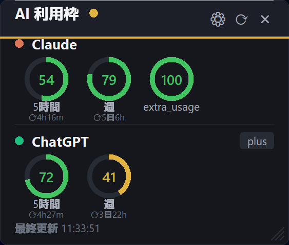

# AI Usage Widget

[](https://github.com/fukuroworksai01-stack/ai-usage-widget/stargazers)
[](LICENSE)
[](https://www.python.org/)
[](https://www.microsoft.com/windows)

**ChatGPT Plus / Claude Pro などの利用枠を、Windowsの小さな常駐ウィジェットで確認する非公式ツールです。**

5時間枠、週枠、クレジット残量などをコンパクトなリング表示で確認できます。AIサービスを使い分けていて「あとどれくらい使えるか」を毎回ブラウザで見に行くのが面倒な人向けです。

> Unofficial desktop widget for checking AI usage limits and remaining credits locally.



スターしておくと、ChatGPT / Claude の利用枠確認ツールをあとからすぐ見つけられます。

## Features

- ChatGPT / Codex の利用枠を `~/.codex/auth.json` からローカル取得
- Claude Pro の利用状況を `claude.ai` の `sessionKey` でローカル取得
- Manus / Cursor / v0 など、JSON APIで残量を返すサービスをカスタム追加
- 残り%とリセットまでの時間をリング表示
- Windows常駐、ドラッグ移動、リサイズ、表示倍率変更、自動更新
- 取得失敗時も直前の値をキャッシュ表示

## Why

AIツールを複数使っていると、利用枠の残量確認だけでブラウザタブや設定画面を行き来しがちです。AI Usage Widgetは、その確認をデスクトップ上の小さな表示にまとめます。

## Supported Sources

| Source | Method | Notes |
|---|---|---|
| ChatGPT / Codex | `~/.codex/auth.json` | Codex CLIでログイン済みなら設定不要 |
| Claude | `sessionKey` Cookie | 設定画面から自動取得、ログイン取得、手動貼り付け |
| Custom AI | JSON API | Cookie / Bearer token / custom headerに対応 |

## Quick Start

```powershell
pip install -r requirements.txt
python ai_usage_widget.py
```

コンソールを出したくない場合:

```powershell
pythonw ai_usage_widget.py
```

## Build EXE

Windowsで `build.bat` を実行すると、`dist\AIUsageWidget.exe` が生成されます。Python環境を持たない人に配布する場合はこちらを使ってください。

```powershell
.\build.bat
```

## Setup

### ChatGPT / Codex

Codex CLIでログイン済みなら、通常は設定不要です。アプリは `~/.codex/auth.json` を自動で探します。

### Claude

ウィジェットの設定画面から Claude の `sessionKey` を設定します。

- 自動取得: Firefoxなどログイン済みブラウザから取得を試します
- ログインして取得: Chrome / Edge の専用ウィンドウでログインし、セッションを取り込みます
- 手動貼り付け: `claude.ai` のCookieから `sessionKey` をコピーして貼り付けます

### Custom AI

設定画面の「カスタムAI」から、残量や使用率を返すJSON APIを追加できます。

例:

- URL: `https://example.com/api/credits`
- value_path: `data.credits.remaining`
- total_path: `data.credits.total`
- reset_path: `data.reset_at`

## Important Notice

このツールは非公式です。ChatGPT / Claude の公式APIとして利用枠取得機能が提供されているわけではなく、各サービスのWebアプリが使う内部エンドポイントや、あなたのPC内のローカル認証情報を使って取得します。

- サービス側の仕様変更で動かなくなる可能性があります
- `sessionKey` などの資格情報は自分のPC内だけで扱ってください
- 設定ファイルは `%USERPROFILE%\.ai-usage-widget\config.json` に保存されます
- 共有PCや職場PCでは利用しないでください
- 各サービスの利用規約を確認し、自己責任で利用してください
- このリポジトリに自分の `config.json` や認証情報をアップロードしないでください

## Files

- `ai_usage_widget.py`: main app
- `build.bat`: Windows EXE build script
- `icon.ico`: app icon
- `README.txt`: Japanese original notes
- `requirements.txt`: Python dependencies

## Roadmap

- Add GitHub Releases with prebuilt Windows EXE
- Improve secure storage for local secrets
- Add provider presets
- Add GIF demo
- Add English README section

## License

MIT License
